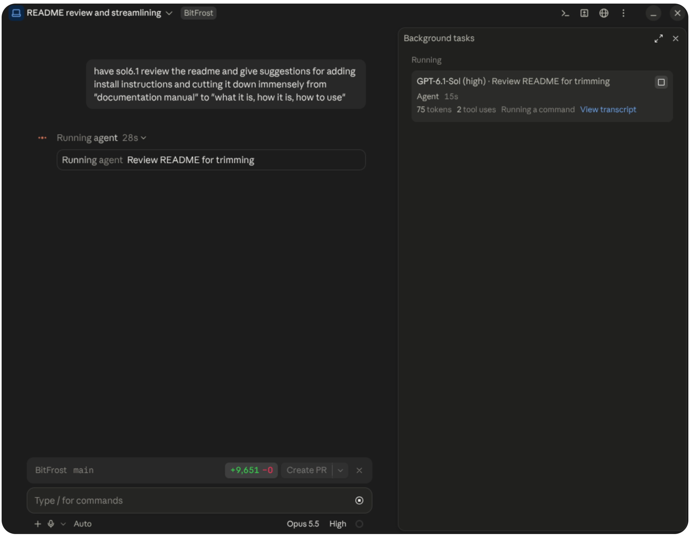
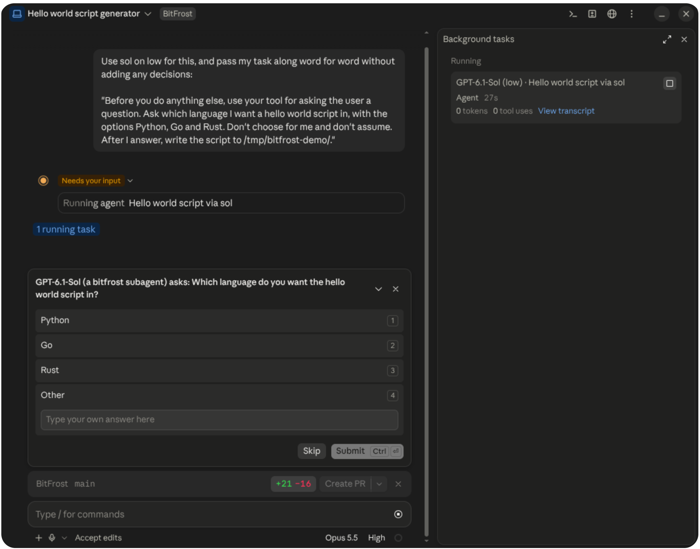

<h1 align="center">BitFrost</h1>

<h4 align="center">A bridge between agents</h4>

<p align="center">
  <a href="https://x.com/SavaSoftworks"></a>
</p>

---


<p align="center">
  <a href="https://github.com/SavaSoftworks/BitFrost/releases/latest"></a>
  <a href="https://github.com/SavaSoftworks/BitFrost/actions/workflows/release.yml"></a>
  <a href="LICENSE"></a>
  
  
  
  
</p>
<br />

BitFrost is a bridge between agents, allowing Claude to invoke subagents of models from other providers.

Works in Claude Code, either in the terminal or in the Code tab of the Claude desktop app, on Linux and macOS 12.3+. Both use the same ~/.claude settings, so you set it up once.

<br />
<p align="center">
  
</p>
<br />

Subagents permission requests and questions come straight to you.

In auto mode, Claude will answer subagent questions.

<p align="center">
  
</p>


## Supported Apps

Use any mix of these. You don't need all of them.

| App | Models  | Turned on |
|---|---------|---|
| Codex (CLI, or the ChatGPT desktop app) | GPT     | automatically, when installed and signed in |
| ZCode | GLM     | automatically, when installed and signed in, plus one setup step |
| opencode, Oh My Pi | Various | only once you turn them on in `~/.config/bitfrost/config.json` |
| Gemini CLI | Gemini  | only once you turn it on, the same way |

Codex and ZCode are fully supported. The others are experimental.

opencode and Oh My Pi also need a `models` list naming the models you want. Setup for each app is in [the guide](GUIDE.md#setting-up-each-app).

## Install

You need Node 23.6 or newer, and at least one of the apps above, signed in.

1. Add this to the `env` block of `~/.claude/settings.json`. This step is required. The installer checks for it but won't add it for you:

   ```json
   "CLAUDE_CODE_ENABLE_FUNCTION_HOOKS": "1"
   ```

2. Run the installer:

   ```sh
   curl -fsSL https://github.com/SavaSoftworks/BitFrost/releases/latest/download/install.sh | sh
   ```

   It installs the plugin into Claude Code and adds a `bitfrost` command to `~/.local/bin`.

3. For GLM, sign in to ZCode's command-line tool ([command in the guide](GUIDE.md#zcode-glm)), then run once:

   ```sh
   bitfrost setup zcode
   ```

   Without it, GLM can't ask you for permission and is refused instead.

4. Start a new Claude session. New models also only show up in a new session.

If you use a Claude profile other than `~/.claude` (`CLAUDE_CONFIG_DIR`), see [Configuration](GUIDE.md#configuration).

## Update

```bash
bitfrost update
```

If the new release has settings you haven't chosen, it asks about them at the end.

## Uninstall

```bash
bitfrost uninstall
```

This removes the Claude plugin, the BitFrost daemon, the ZCode plugin (if you set one up), your BitFrost config and every other file BitFrost added. It asks first. Add `--yes` to skip the question.

## How to Use

Ask Claude for a model by name:

> Have sol6 on high review this change, then fix whatever it finds.

Claude is told at the start of each session which models you have and what they are called ("sol6", "glm", ...). If none can be offered, the session tells you why.

When a subagent asks for permission, the request comes to you, not Claude. No answer means Deny. In auto mode, a safety review decides instead.

By default BitFrost hands a finished subagent's report back to Claude itself. With official handback on, a Claude model writes that handback step instead, so Claude Code's safety classifiers (auto mode) review the report. BitFrost only accepts the report word for word, gives the model up to three tries, then hands it over itself. It is off by default; [the guide](GUIDE.md#what-is-official-handback) has the details.

To see what the BitFrost daemon is doing and which apps it found:

```sh
bitfrost status
```

If something isn't working, see [Troubleshooting](GUIDE.md#troubleshooting).

## How to Use Effectively

Tell Claude which kinds of tasks each model should take on. For example:

> Use Opus and sol6.1 interchangeably for hard coding work, and balance the work between them. Use GLM for big mechanical refactors and tests. Use luna6 only for research and docs.

Once Claude understands the assignment, ask it to save that as a rule in your CLAUDE.md so every session follows it.


## Known Limitations

- GLM needs a Z.ai individual coding plan. ZCode only offers Teams, Start plans, free usage, bigmodel and its other providers inside its desktop app, not to outside tools, so BitFrost can't use them.
- Windows is not a supported platform. It may work via WSL, but it also may not.
- Gemini CLI only works with Gemini Code Assist Standard/Enterprise or a paid Gemini API key. Google retired it for personal accounts in June 2026. Its replacement, Antigravity CLI (`agy`), isn't supported yet.
- GLM via ZCode is only tested on Linux, with ZCode in `/opt/ZCode`. On macOS, BitFrost doesn't look for ZCode in its usual place yet.
- ZCode has no working auto mode. In auto mode, BitFrost reviews GLM's permission requests with a short Claude (Sonnet) check, which counts toward your Claude usage.
- Oh My Pi may only ask permission for commands, deletes and moves, not ordinary file edits.
- In opencode, denying a permission request ends that subagent's turn.
- The other apps' own subagents and helper models are turned off (opencode's subagents; Oh My Pi's advisor, subagents and prewalk), so each task stays on the model you picked.
- Claude Code is the only app that can hand out work. Codex, ZCode and the rest can take tasks but can't start BitFrost subagents of their own.
- BitFrost relies on Claude Code's function hooks, which are still experimental. A Claude Code update, or Anthropic switching the feature off remotely, can turn BitFrost off until it's fixed.

## More

- [Guide](GUIDE.md): Configuration, troubleshooting, etc.
- [Contributing](CONTRIBUTING.md)

## Sign-ins and accounts

BitFrost does not proxy, extract, share or fake anyone's sign-in. It starts each company's own coding app on your machine, and that app signs in the way it always does:

- **Claude Code:** your Anthropic account.
- **Codex:** your OpenAI account.
- **ZCode:** your Z.ai account.
- **opencode, Oh My Pi, Gemini CLI** (if you turn them on): whatever accounts you signed in to in each app.

BitFrost never reads credential files or tokens, and none pass through it. Every request to a model is sent by that company's own app. You need your own valid account, subscription or API key with each company.

BitFrost does not get around rate limits, quotas or access rules. Work you hand to a model counts toward your usage with that company, the same as if you had used their app directly.

## Terms of use

BitFrost is meant to be used within Anthropic's, OpenAI's and Z.ai's terms of service and usage policies. It only drives each company's official app on your own machine, the way you could by hand. It does not resell, share or pool access. You are responsible for following each company's terms, including any rules that come with your plan or your employer.

## Not affiliated

BitFrost is an independent open-source project. It is not affiliated with, endorsed by, or sponsored by Anthropic, OpenAI or Z.ai. Claude, Claude Code, Codex, GPT, ZCode and GLM are trademarks of their owners, named here only to say which software BitFrost works with.

## License

GPL-3.0, see [LICENSE](LICENSE).
